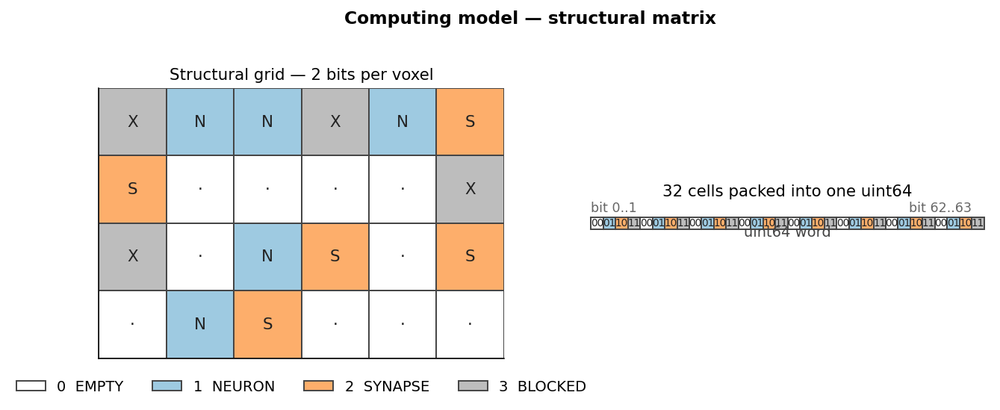
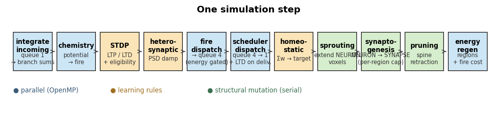
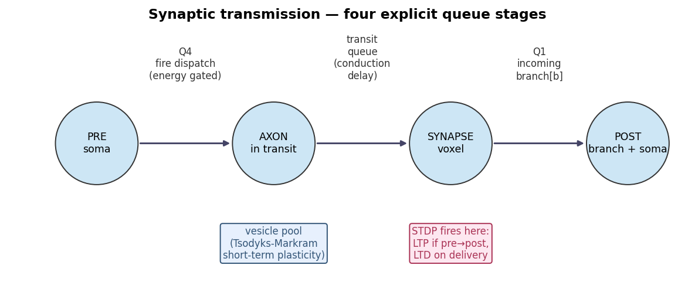
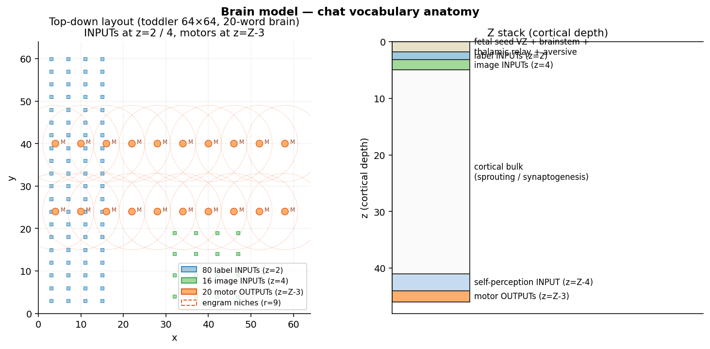
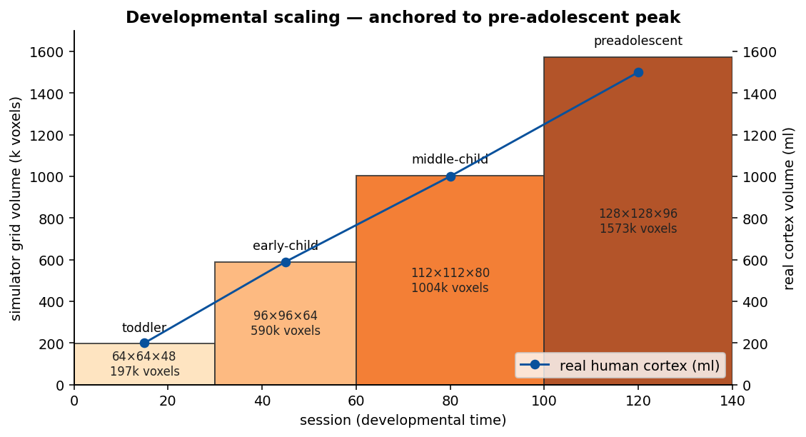
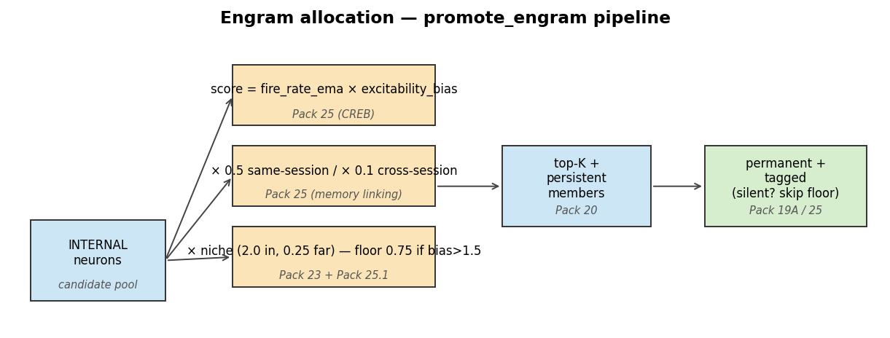
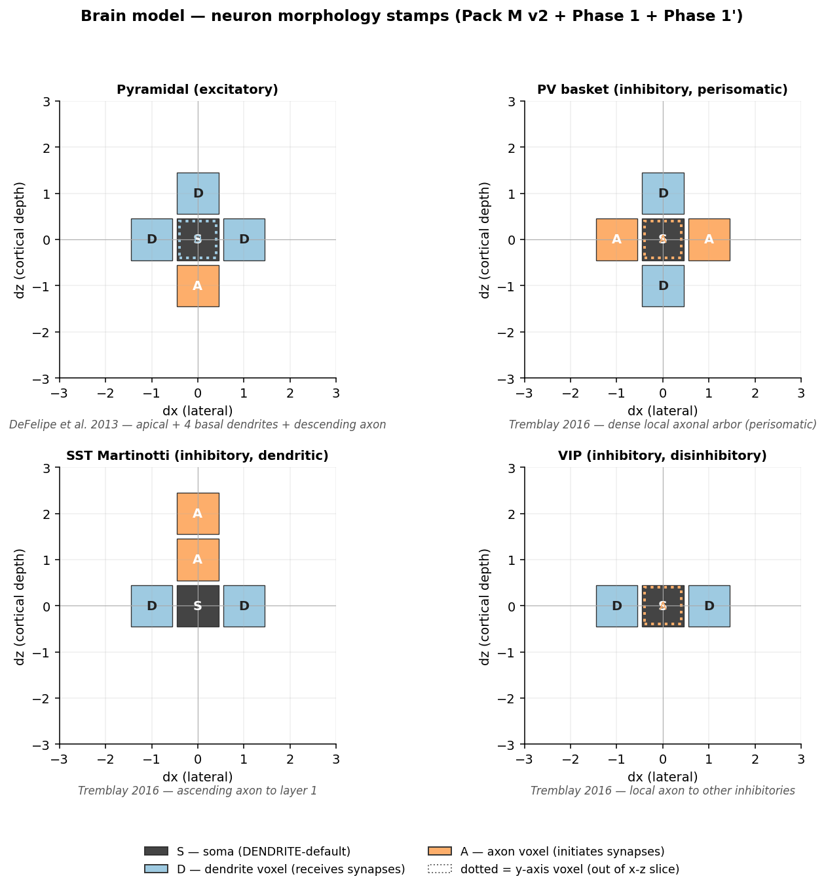

# Structural Neuromorphic Computing (SNC)

A C++ simulator that grows a brain-like network from biological-development
rules — voxel-by-voxel structural plasticity on top of a per-neuron leaky
integrate-and-fire chemistry, with sensory organs, multimodal teaching, and
sleep-driven consolidation. The long-term goal is **pre-adolescent cortical
capability**: minimal mathematical and communication skill grown from real
human-like input/output rather than hand-engineered features.

This README explains the two complementary models that the project rests on:

1. **The computing model** — how a step is executed, how state is laid out in
   memory, and why the design separates structural geometry from per-neuron
   dynamics.
2. **The brain model** — what biology is actually represented (sensory
   organs, cortical layout, engrams, GABAergic subtypes, sleep, developmental
   scaling) and which primary literature each piece is grounded in.

The detailed pack-by-pack history (what was tried, what regressed, what
shipped) lives in the auto-memory under
`~/.claude/projects/-home-chanyoung-snc/memory/`. The current live baseline
is **Pack 26-A.tune.lite — cochlear pathway** (commit `8dfd007`) —
**100% accuracy across 25 sessions** with 20/20 perfect recall in
pure-review, AND the brain hears each word spoken (formant-shaped
cochlear input) in parallel with the symbolic label drive.

This is the cumulative outcome of the whole pack history. The road there:

- **Pack 24-curriculum** (75% s15 on 12 words) — spaced rehearsal of
  the oldest word every 3 sessions.
- **Pack 25 / 25.1** — CREB-style engram allocation, memory linking,
  silent engrams, bias-overrides-niche.
- **Pack P-lite v1 / v2** (83% → 91.7% s15) — event-driven spike
  dispatch via a `DeliveryEvent` ring; deterministic OpenMP via
  per-target bucketing. Realises the user's "actor model + work queue"
  parallel computing model on the fast spike-dispatch path.
- **Pack ZZ v3** (91.7% s15) — microglial pruning (silence-age + weak
  weight + tag-protection) with CD47/SIRPα-style protection of
  permanent / engram synapses.
- **Pack M v2** (91.7% s15) — real neuron shapes stamped at birth via
  per-cell-type morphology templates. The "3 BLOCKED" voxel state
  finally encodes actual neuron tissue.
- **Phase 1 morphology refactor** (100% s15) — synaptogenesis becomes
  AXON × DENDRITE only, matching real cortical chemistry. Spurious
  NEURON × NEURON contacts no longer become synapses. *This was the
  prerequisite that took five attempts to discover.*
- **Phase 1' expansion** — multi-voxel pyramidal + interneuron arbours
  (DeFelipe 2013 pyramidal; Tremblay, Lee & Rudy 2016 interneurons).
  See [docs/figures/07_neuron_morphology.png](docs/figures/07_neuron_morphology.png)
  for a visual of all four cell-type shapes.
- **Vocabulary expansion 12 → 16 → 20** — added number basics
  (one..four) and colour basics (red, green, blue, yellow); 8
  semantic groups in total.
- **Pack 26-A.tune.lite — cochlear pathway** (`8dfd007`) — 8 cochlea
  bins → 8 A1 cells via direct labelled-line (weight 0.55, delay 13);
  A1 → motor plastic at weight 0.0 grown by STDP. Peterson-Barney
  1952 vowel formants over Greenwood 1990 log-frequency cochlear
  bins. After **5 prior reverts** pre-Phase-1, the cochlear pathway
  finally lands cleanly because Phase 1's AXON × DENDRITE rule
  prevents the spurious organic A1↔motor contacts that broke every
  prior attempt.

---

## Quick start

```bash
cmake -S . -B build
cmake --build build -j

# Tiny structural-only demo
./build/snc_demo

# Conversational REPL with 20-word vocabulary
./build/snc_chat

# 15-session lifetime sweep with the current curriculum
python3 scripts/run_lifetime.py
```

OpenMP is detected automatically. Without it the code still builds and runs
single-threaded.

---

## Repository layout

```
include/
  brain_grid.hpp      2-bit packed 3D structural matrix
  energy_field.hpp    coarse regional energy budget
  neuron.hpp          per-neuron state (chemistry, body, synapses)
  simulator.hpp       orchestrates one simulation step
src/
  brain_grid.cpp      grid storage, neighbour iteration
  energy_field.cpp    regional energy bookkeeping
  simulator.cpp       phases: integrate, chemistry, STDP, ... pruning
  chat_demo.cpp       20-word teaching REPL (the main demo)
  vocab_demo.cpp      4-word fixed-vocabulary demo (legacy)
  mom_dad_demo.cpp    minimal 2-word demo
  learn_demo.cpp      data-driven feature-classification demo
  aversive_demo.cpp   negative-reinforcement demo
  test_stdp.cpp       STDP unit tests
docs/
  figures/            documentation diagrams (PNG + render script)
scripts/
  run_lifetime.py     multi-session lifetime sweep + plots
  ...                 visualisation helpers (3D anatomy, voxel dumps)
resource/             primary literature PDFs (Kandel, Sporns, etc.)
```

---

## Computing model

### Two layers, deliberately decoupled

The simulator stores the spatial **occupancy state** of the tissue (where
neurons and synapses physically are) separately from the per-neuron
**chemistry state** (membrane potential, firing rate, vesicle pool). Spatial
plasticity rules act on the structural grid; learning rules act on the
chemistry. They communicate through a tiny `owner_` map and a fixed phase
ordering — they never share memory directly.

This separation means:

- The structural grid can be packed to **2 bits per voxel** (32 voxels per
  `uint64_t`), giving a fast cache-friendly representation of "where is
  tissue" that is independent of how many synapses or how much chemistry each
  cell has.
- Adding biology (e.g. astrocyte calcium, dopamine reward, engram
  consolidation) only touches the per-neuron / per-synapse state. The grid
  doesn't know or care.

### The 2-bit structural grid



| value | meaning                                            |
| :---: | -------------------------------------------------- |
| `0`   | EMPTY — free space, available for sprouting        |
| `1`   | NEURON — soma / dendrite / axon                    |
| `2`   | SYNAPSE — synaptic contact between two neurons     |
| `3`   | BLOCKED — radial-glia analogue, can't become a synapse |

The grid keeps a front and a back buffer so a strict cellular-automaton sweep
is possible via `swap_buffers()`. The current algorithm uses asynchronous,
activity-driven updates (only recently-active neurons can sprout or form
synapses), so the back buffer is exposed but rarely used by the default
phases.

A small auxiliary `owner_` map (one `uint32_t` per voxel) records which
neuron owns which voxel — this is **not** part of the 2-bit grid. It exists
purely so synaptogenesis can tell whether two adjacent NEURON voxels belong
to two different cells.

### Per-neuron state

Each neuron carries a tiny LIF model plus everything needed for structural
and learning rules:

```cpp
struct Neuron {
  uint32_t id;
  Voxel    soma;                    // primary voxel
  std::vector<Voxel> body;          // all NEURON-state voxels owned

  NeuronRole       role;            // INTERNAL / INPUT / OUTPUT
  NeuronPolarity   polarity;        // EXC / PV / SST / VIP
  int              channel;         // for INPUT / OUTPUT and pathway sentinels

  float potential, input_acc, fire_rate_ema;
  float predicted_input;            // for predictive coding
  float activity_baseline;          // BCM sliding threshold
  float ltp_received_this_step;     // for heterosynaptic damping
  float excitability_bias;          // CREB-style engram allocation bias

  uint8_t              n_branches;
  std::vector<float>   branch_potential, branch_threshold, branch_passive_gain;
  std::vector<SynapseEdge> outgoing;
  std::vector<float>   incoming_queue;
};
```

Synapses live as `outgoing` edges on the pre-synaptic neuron and carry their
own state: weight, eligibility trace, consolidation tag, vesicle pool,
conduction delay, and a transit queue for in-flight spikes.

### One simulation step

Every step runs the same fixed sequence of phases:



- **Parallel phases** (chemistry, integrate, fire dispatch, scheduler,
  energy regen) are O(N_neurons) and run under OpenMP. They use `omp atomic`
  for cross-neuron writes when needed.
- **Learning phases** (STDP, heterosynaptic damp, homeostatic scaling) update
  weights from purely local information — each synapse reads only its own
  pre/post state.
- **Structural-mutation phases** (sprouting, synaptogenesis, pruning) run
  serially because they mutate the grid, owner map, and per-neuron body
  vectors. Their work is bounded by *recently-active* neurons, not total
  grid size, so the wall-clock cost stays small even at 128×128×96.

### Synaptic transmission — four explicit queue stages

A spike from PRE to POST passes through four named queues, mirroring the
biological pathway from axon initial segment to post-synaptic dendrite:



- **Q4 (fire dispatch)**: when a neuron fires, every outgoing synapse is
  enqueued into its own transit queue, gated by the local energy budget.
  Strong synapses survive a low-energy soma; weak ones are dropped (vesicle
  pool depletion under metabolic stress).
- **Transit queue**: each packet has a `delay_remaining` matching the
  conduction delay of that synapse (Manhattan distance in voxels). Packets
  advance one step per simulation step.
- **Synapse voxel**: when a packet arrives, STDP fires (LTD if the post
  fired before, LTP if the post fires within the window after). The vesicle
  pool dynamics (Tsodyks-Markram) modulate effective release magnitude.
- **Q1 (incoming)**: the post's `branch_potential[b]` accumulates the spike;
  the next `integrate_incoming_phase` decides per branch whether the
  dendritic-spike threshold is crossed.

### Three-factor learning

Plain Hebbian / STDP is supplemented by global neuromodulator scalars,
mirroring the diffuse-projection systems of real cortex:

- **Dopamine-style reward**: a per-class scalar broadcast to all synapses;
  each synapse applies `weight += reward_lr * reward * eligibility`. The
  eligibility trace is per-synapse and decays by `eligibility_decay` per
  step. (Three-factor learning, Frémaux & Gerstner 2016.)
- **Acetylcholine** scales STDP gain (attention).
- **Norepinephrine** shifts the BCM threshold (novelty / arousal).
- **Serotonin** scales reward consolidation rate (mood).
- **Aversive amplification** weights punishment ~2.5× more than equivalent
  reward (negativity bias; Baumeister 2001, Kahneman & Tversky 1979).

### Energy throttle

The volume is partitioned into cubic regions (default `8³` voxels). Every
region holds a single energy budget. Firing, sprouting, synapse formation,
and synapse use all draw from the local region; energy regenerates by a fixed
amount per step. Hot regions therefore cannot keep growing — the substrate
self-regulates structural change to local metabolic capacity.

### Sleep / consolidation

Three modes drive the network with internal noise (no external input) and
boosted STDP, mirroring the neurophysiology of slow-wave / REM sleep:

- `sleep_consolidate(n_steps, boost)` — pure noise replay.
- `sleep_replay_patterns(...)` — random patterns from a given pool, attention
  high (REM-like).
- `sleep_sws_replay(...)` — sequenced replay of patterns in original order
  with brief silences between them, attention attenuated (slow-wave-like
  hippocampal sharp-wave-ripples).

---

## Brain model

The simulator is biology, not just an arbitrary substrate. Every architectural
choice traces to a primary source. The current vocabulary brain (`snc_chat`)
uses a 64×64×48 toddler grid that scales out to 128×128×96 by sessions ≥100.

### Cortical anatomy of the chat brain



**Channel layout** (input neurons):

| range          | meaning                          | count |
| :------------: | -------------------------------- | :---: |
| `[0, 47]`      | label sensory features           | 48    |
| `[48, 59]`     | efference / self-perception      | 12    |
| `[60, 75]`     | retinotopic image pixels (4×4)   | 16    |

For each of the 12 concepts (`mom dad baby ball dog cat hi bye yes no more
stop`):

- **4 label INPUT neurons** at `z=2` (verbal sensory features)
- **4 retinotopic image bits** at `z=4` (hand-designed 4×4 visual referent)
- **1 motor OUTPUT** at `z=Z-3` with two dendritic branches
- **1 self-perception INPUT** at `z=Z-4` (efference copy: "hearing yourself
  say it")
- **1 lateral PV inhibitor** projecting to all *other* motors
- **1 engram niche** (sphere of radius 9 around the motor column) biasing
  promote_engram toward this anatomical region

**Innate priors installed at build time**:

- `label INPUT → motor` (weight 0.55, delay 4, permanent labelled-line)
- `image INPUT → motor` for the concept's 4 pixels (weight 0.55, permanent)
- `motor → self-perception INPUT` (weight 1.4, delay 1, permanent)
- `motor → lateral PV inhibitor → other motors` (winner-take-all)

The bulk of the cortex is sparse fetal seed (~160 VZ neurons, brainstem
analogue, thalamic relay analogue, amygdala-analogue aversive nucleus).
Sprouting and synaptogenesis grow the connectome from there.

### Developmental volume scaling



Real human cortical volume peaks at ~1500 ml around early adolescence
(Giedd 1999). The simulator's grid scales through four stages anchored to
that trajectory; at each stage transition, `grow_volume` expands the
structural matrix while preserving every existing neuron and synapse.

| stage         | sessions  | grid          | neurons added per session |
| ------------- | :-------: | :-----------: | :-----------------------: |
| toddler       | 0–29      | 64×64×48      | 7                         |
| early-child   | 30–59     | 96×96×64      | 15                        |
| middle-child  | 60–99     | 112×112×80    | 25                        |
| preadolescent | 100+      | 128×128×96    | 40                        |

Lifelong neurogenesis (`birth_neurons`) places newborn VZ neurons each load.

### Multimodal sensory input

Each modality is biologically grounded — the brain receives stimuli through
simulated organs, not through ML-style feature vectors:

- **Verbal labels** drive 48 INPUT neurons with binary patterns (2 of 4 bits
  per concept). Permanent priors connect each to its motor.
- **Self-perception / efference copy** lets the network "hear itself
  speaking" — the motor's spike feeds back to a dedicated INPUT neuron via
  a permanent fast (delay-1) synapse.
- **Saccadic vision** (Pack 21): the 4×4 retinotopic image is divided into
  four 2×2 quadrants; up to 4 fixations greedy-select the most-active
  unfixated quadrant per saccade. Foveal-acuity analogue.
- **Cochlear pathway (Pack 26-A.tune.lite, LANDED)**: 8 log-frequency
  cochlea bins (Greenwood 1990) → 8 A1 cells via direct labelled-line
  (delay 13, collapsing the biological CN+IC+MGN cascade — Schreiner
  & Winer 2007). A1 → motor plastic at weight 0.0 grown organically
  by STDP. Per-word formants from Peterson-Barney 1952. The brain
  hears each word spoken (formant-shaped cochlear input) in parallel
  with the symbolic label drive.

### Engram protection and allocation

Memories are stored as **distributed cell assemblies** (Josselyn & Tonegawa
2020 *Science*), not as weight matrices. The `promote_engram` API selects
the cells that just produced a correct response, marks every synapse
between them as `permanent`, pins their consolidation tag, and floors their
weight at half of `weight_max` so the recall path is electrically functional
even before STDP has fully strengthened it. Permanent synapses are exempt
from STDP-LTD, heterosynaptic damping, homeostatic down-scaling, negative
reward, and aversive learning.



Successive packs refined the allocation rule to match biology:

- **Pack 19A**: `permanent` flag exempts protected synapses from all decay
  paths.
- **Pack 20**: persistent `engram_members_` per class — repetition reinforces
  the same cell assembly rather than spawning a new one (the "intelligence
  by repetition" invariant).
- **Pack 23**: per-class spatial niche (sphere of radius 9 around the motor
  column) — different concepts settle in different cortical regions
  (analogue of FFA / PPA / etc.).
- **Pack 25** (CREB allocation, Han et al. 2007): score by
  `fire_rate_ema × excitability_bias`. The teach episode bumps
  `excitability_bias = 3.0` on the cells anatomically tied to the concept;
  `promote_engram` then ranks them ahead of noise-driven bulk neurons.
- **Pack 25** (memory linking, Josselyn & Tonegawa 2020): two classes
  promoted in the same `session_id` share engram cells more freely (0.5×
  fresh-neuron penalty) than classes from different sessions (0.1× penalty)
  — encodes temporal contiguity.
- **Pack 25** (silent engrams, Tonegawa et al.): a `silent=true` promote
  records membership and tags structure permanent but skips the weight
  floor; the engram exists but is below recall threshold until reactivated
  by a strong artificial cue.
- **Pack 25.1**: cells with `excitability_bias > 1.5` clamp the niche
  multiplier to ≥ 0.75×; molecular pre-encoding overrides spatial bias.

### Neuron morphology — actual 3D shapes per cell type

The simulator's name is *Structural* Neuromorphic Computing — the structural
matrix is supposed to represent real neuronal morphology. Pack M v2 + Phase 1
+ Phase 1' implements that: each neuron is born with an actual 3D shape
stamped at birth, with explicit DENDRITE / AXON / AXON_TRUNK roles per voxel.



| cell type | dendrites | axon | reference |
| --------- | --------- | ---- | --------- |
| Pyramidal (excitatory) | apical (+z) + 4 basal (±x, ±y) | descending (-z) | DeFelipe et al. 2013 *Nat. Rev. Neurosci.* 14:202 |
| PV basket (perisomatic inh) | (±z) | dense local arbor (±x, ±y) | Tremblay, Lee & Rudy 2016 *Neuron* 91:260 |
| SST Martinotti (dendritic inh) | (±x) | 2-voxel ascending (+z, +2z) | Tremblay 2016 |
| VIP (disinhibitory) | (±x) | bipolar lateral (±y) | Tremblay 2016 |

Soma defaults to DENDRITE (it can receive synapses, like real cell bodies in
perisomatic-targeted PV synapses). Sprouted body voxels default to DENDRITE.
The Pack M template stamps explicit AXON role on the cell's projection
direction. `synaptogenesis_phase` requires AXON-of-pre meeting DENDRITE-of-post
before forming a chemical synapse — random NEURON × NEURON contacts are
biologically meaningless and no longer become synapses.

This is what took five Pack 26-A reverts to figure out. Once
`synaptogenesis_phase` enforced the chemistry asymmetry directly, the
cochlear pathway integrated cleanly with the labelled-line recall path.

### Excitatory / inhibitory balance

Dale's principle is enforced: each neuron releases only excitatory or
inhibitory neurotransmitter at every synapse. Three GABAergic subtypes are
tracked (Tremblay, Lee & Rudy 2016):

- **PV** parvalbumin basket cells (~14%) — fast perisomatic inhibition.
- **SST** somatostatin Martinotti cells (~4%) — slow dendrite-targeted
  gating.
- **VIP** vasoactive intestinal peptide (~2%) — disinhibits SST,
  opening dendritic plasticity windows.

Inhibitory polarity flips spike sign at dispatch; that gives the network the
sparse-coding / winner-take-all dynamics needed for clean output decoding.

### Plasticity rules

- **STDP** (Bi & Poo 1998): exponential temporal kernel; LTD slightly larger
  than LTP for net stability.
- **Sensitive-period boost** (Hensch 2005): STDP amplitude is multiplied by
  `1.3 × exp(−t / 6000)` early in development — language-acquisition window
  in primary auditory cortex.
- **BCM metaplasticity** (Bienenstock, Cooper & Munro 1982): post's running
  baseline activity acts as a sliding threshold; chronically over-active
  neurons stop accreting LTP.
- **Heterosynaptic damping** (Royer & Paré 2003): post-synaptic-density
  resource competition shrinks every other incoming synapse when one is
  potentiated.
- **Homeostatic synaptic scaling** (Turrigiano 2008): each post rescales its
  incoming weights toward `homeostatic_target_in`, the simulator analogue of
  retrograde TNF-α / BDNF signalling.
- **Synaptic tagging-and-capture** (Frey & Morris 1997): LTP events above a
  threshold set a long-timescale consolidation tag; tagged synapses are
  shielded from spine retraction.
- **Tripartite-synapse / astrocyte** (Halassa & Haydon 2010): per-region
  calcium gates LTP amplitude — the astrocyte reports "this region is
  working hard, go ahead and consolidate".

### Curriculum: how the brain learns

The lifetime sweep (`scripts/run_lifetime.py`) drives N sessions each as a
fresh load of `snc_chat`:

- Session 1: bootstrap (`babble 30` + teach mom, dad twice each).
- Sessions 2..len(ALL_WORDS): each teaches one new word (twice with reward)
  and probes all taught so far. **Pack 24-curriculum**: every 3rd session
  re-teaches the oldest word once (spaced rehearsal — empirically validated
  2× retention advantage over massed repetition).
- Sessions len(ALL_WORDS)+1..N: pure review (no new teaching). Adding random
  babble or imagery rehearsal hurt baseline; silent space + probes let
  consolidation finish.

**Current best**: **100% accuracy across 25 sessions** (20/20 words recalled
correctly without label cues throughout pure-review). The 20-word
vocabulary is from CHILDES and the MacArthur-Bates CDI early-acquisition
lists, organised as 12 toddler concepts + 4 number basics + 4 colour basics
across 8 semantic groups.

---

## Primary-source grounding

PDFs in `resource/` (the ones currently load-bearing for the architecture):

| topic | citation | file |
| ----- | -------- | ---- |
| Engram cells, allocation, linking | Josselyn & Tonegawa 2020 *Science* 367:eaaw4325 | `Submitted Version_aaw4325_*.pdf` |
| GNW theory of consciousness | Mashour, Roelfsema, Changeux & Dehaene 2020 *Neuron* 105 | `Conscious-Processing-and-the-Global-Neuronal-Works.pdf` |
| Integrated Information Theory 4.0 | Albantakis, Barbosa, Findlay, Grasso, Haun, Marshall, Mayner, Zaeemzadeh, Boly, Juel, Sasai, Tsuchiya, Tononi 2023 *PLoS Comp. Bio.* | `journal.pcbi.1011465.pdf` |
| Cogitate / GNWT vs IIT empirical test | Cogitate Consortium / Melloni 2025 *Nature* 642 | `s41586-025-08888-1.pdf` |
| Networks of the Brain | Sporns *Networks of the Brain* (MIT Press, 2010) | `Sporns_Book.pdf` |
| Synaptic pruning by microglia | Xing, Wang, Yang, Tang 2026 *NRR* 21:1698 | `NRR-21-1698.pdf` |
| BMI / motor decoding (Kandel) | Kandel et al. *Principles of Neural Science* 6e Ch. 39 | `PNS-6thEdition-SectionV-Motor-Chapter39-BMIs.pdf` |

Bonus papers (not yet load-bearing but in scope for upcoming packs):
microglial cholesterol metabolism / TREM2, AMPAR trafficking, dopamine
projection populations, GABA/glutamate balance in motor cortex,
human-cortex evolution.

---

## Status and roadmap

**Live baseline**: Pack 26-A.tune.lite cochlear pathway (`8dfd007`) —
**100% accuracy across 25 sessions, 20/20 perfect recall in pure-review**,
with the brain hearing each word spoken via the cochlear pathway in
parallel with the symbolic label drive.

**Pack history (all on `feat/snc-core-and-embodied-demo`)**: 19A engram
protection · 19B `know/guess/unknown` protocol · 19D demand-driven growth ·
20 persistent engram membership · 21 saccadic vision · 22 drop babble in
review · 23 spatial niches · 24-curriculum spaced rehearsal · 25 CREB +
memory linking + silent engrams · 25.1 bias-overrides-niche · P-lite v1/v2
event-driven dispatch + parallel work queue · ZZ v3 microglial pruning ·
M v2 real neuron shapes · Phase 1 AXON × DENDRITE synaptogenesis · Phase 1'
multi-voxel arborisations · vocab 12 → 16 → 20 (number + colour basics) ·
26-A.tune.lite cochlear pathway.

**Reverted (recorded as lessons)**: aggressive multi-trial teach,
microglial pruning v1/v2, GNW connector hubs without ignition gating,
cochlear pathway × 5 attempts pre-Phase-1, Pack M v1 NEURON-stamped — see
`~/.claude/projects/-home-chanyoung-snc/memory/snc_lessons.md`.

**Next**: Pack 26-B (visual organ — retina + ganglion + LGN + V1) along
the same pattern as 26-A.tune.lite: install peripheral relays as
permanent labelled-line, plastic terminal connections at weight 0.0,
let Phase 1 prevent spurious synapses while STDP shapes the rest.

**Full plan** through the pre-adolescent goal: see [docs/ROADMAP.md](docs/ROADMAP.md).
Order: Pack 26-B (visual) → Pack 26-C (motor speech) → Pack 27
(diagnostics) → Pack 28 (predictive coding) → Pack 29 (counting +
two-word combinations) → Pack 30+.

---

## Notes

- `(X * Y) % 32 == 0` is required so z-slice parallelism never causes two
  threads to update bits inside the same packed word. All current grid
  sizes (`64 / 96 / 112 / 128` × `64 / 96 / 112 / 128`) satisfy this.
- The save format is **SNC9** (binary, host-endian); see
  `Simulator::save_state` for the layout.
- Auto-memory under `~/.claude/projects/-home-chanyoung-snc/memory/`
  preserves the project's per-pack history across sessions. The on-disk
  state of the source code does not narrate the project's history; the
  memory does.

Figures under `docs/figures/` are regenerated by:

```bash
python3 docs/figures/render_figures.py
```
